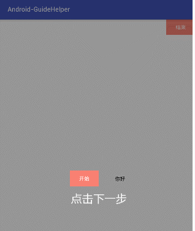

# Android-GuideHelper
Android蒙版向导
#效果



这次主要是使用了自定义Dialog的方式来实现这个效果
主要步骤：
1、创建一个自定义VIew的Dialog
2、复制一个需要高亮显示的View在同样的位置，并完美覆盖
3、绘制提示图片

思考：第一步和第三步都比较轻松，难点是第二步，如何复制一个View并完美覆盖 。

第一步：创建一个自定义VIew的Dialog

    guidelayout = new RelativeLayout(activity);

    //创建Dialog，遮挡状态栏
    guideDialog = new Dialog(activity, android.R.style.Theme_DeviceDefault_Light_DialogWhenLarge_NoActionBar);
    //设置背景颜色
    guideDialog.getWindow().setBackgroundDrawable(new ColorDrawable(0x66000000));
    //设置自定义的布局
    guideDialog.setContentView(guidelayout);
    //设置布局的属性
    guideDialog.getWindow().setLayout(WindowManager.LayoutParams.MATCH_PARENT, WindowManager.LayoutParams.MATCH_PARENT);
    //设置点击不能取消
    guideDialog.setCancelable(false);
    //显示Dialog
    guideDialog.show();

第二步：复制一个需要高亮显示的View在同样的位置，并完美覆盖

步骤如下：
1、获取原来的VIew的位置和宽高
2、获取自定义布局在视图的位置，View的Y轴坐标减去这个位置的Y轴坐标，避免Dialog不是全屏的时候位置偏移，就可以可以实现全局覆盖了
3、获取原来的VIew的视图缓存
4、根据视图缓存获取bitmap
5、创建一个ImageView，设置位置，把bitmap设置为背景

1、获取原来的View的位置和宽高
  ```
 //获取view的宽高
int vWidth = lightView.getMeasuredWidth();
int vHeight = lightView.getMeasuredHeight();
   
//如果宽高都小于等于0，再measure试下获取
if (vWidth <= 0 || vHeight <= 0) {
               ViewGroup.LayoutParams mlayoutParams = lightView.getLayoutParams();
               lightView.measure(mlayoutParams.width, mlayoutParams.height);
               vWidth = lightView.getMeasuredWidth();
               vHeight = lightView.getMeasuredHeight();
}
   
           //获取不到宽高则返回操作
           if (vWidth <= 0 || vHeight <= 0) {
               Log.e("GuideHelper", "宽高都小于等于0");
               return;
           }
```

2、获取自定义布局在视图的位置，View的Y轴坐标减去这个位置的Y轴坐标，避免Dialog不是全屏的时候位置偏移，就可以可以实现全局覆盖了
```
//获取view在屏幕的位置
int[] location = new int[2];
lightView.getLocationOnScreen(location);

//获取layout在屏幕上的位置
int layoutOffset[] = new int[2];
guidelayout.getLocationOnScreen(layoutOffset);

//这里避免dialog不是全屏，导致view的绘制位置不对应
location[1] -= layoutOffset[1];

3、根据视图缓存获取bitmap
//开启能缓存图片信息
lightView.setDrawingCacheEnabled(true);
//获取视图缓存
lightView.buildDrawingCache();

Bitmap LightBitmap = lightView.getDrawingCache();
if (LightBitmap != null) {
  //根据缓存获取Bitmap
  LightBitmap = Bitmap.createBitmap(LightBitmap);
} else {
  //如果获取不到，则用创建一个view宽高一样的bitmap用canvas把view绘制上去
  LightBitmap = Bitmap.createBitmap(vWidth, vHeight, Bitmap.Config.ARGB_8888);
  Canvas canvas = new Canvas(LightBitmap);
  lightView.draw(canvas);
}

//关闭能缓存图片信息
lightView.setDrawingCacheEnabled(false);
//释放缓存
lightView.destroyDrawingCache();
```
4、创建一个ImageView，设置位置，把bitmap设置为背景，添加到布局
```
//设置ImageView属性
ImageView newLightView = new ImageView(activity);
newLightView.setScaleType(ImageView.ScaleType.CENTER_INSIDE);
newLightView.setImageBitmap(LightBitmap);

//动态设置Viwe的id
int imageViewId = R.id.snack;
newLightView.setId(imageViewId);

//设置位置
RelativeLayout.LayoutParams params = new RelativeLayout.LayoutParams(ViewGroup.LayoutParams.WRAP_CONTENT, ViewGroup.LayoutParams.WRAP_CONTENT);
params.leftMargin = location[0];
params.topMargin = location[1];

//添加到布局
guidelayout.addView(newLightView, params);
```
到这里就完成对需要高亮的View的复制了，注意的是这个view最好设置背景颜色，不然有可能没有效果。


显示提示图片：就是获取资源的Bitmap，然后创建ImageView，设Bitmap为背景
```
/**********显示提示图片**********/
//获取提示图片的Bitmap
Bitmap tipBitmap = BitmapFactory.decodeResource(activity.getResources(), tipsImageResourceId);

//设置大小
RelativeLayout.LayoutParams layoutParams = new RelativeLayout.LayoutParams(ViewGroup.LayoutParams.WRAP_CONTENT, ViewGroup.LayoutParams.WRAP_CONTENT);
int showViewHeight = tipBitmap.getHeight();
int showViewWidth = tipBitmap.getWidth();

//设置ImageView属性
ImageView newTipView = new ImageView(activity);
newTipView.setScaleType(ImageView.ScaleType.CENTER_INSIDE);
layoutParams.width = showViewWidth;
layoutParams.height = showViewHeight;
newTipView.setImageBitmap(tipBitmap);

//设置间距(可自行封装)
//layoutParams.topMargin += dipToPix(activity, 20);

//设置相对位置(可自行封装)
layoutParams.addRule(RelativeLayout.BELOW, newLightView.getId());
layoutParams.addRule(RelativeLayout.ALIGN_LEFT, newLightView.getId());
//layoutParams.addRule(RelativeLayout.CENTER_HORIZONTAL);

//添加到布局
guidelayout.addView(newTipView, layoutParams);
```